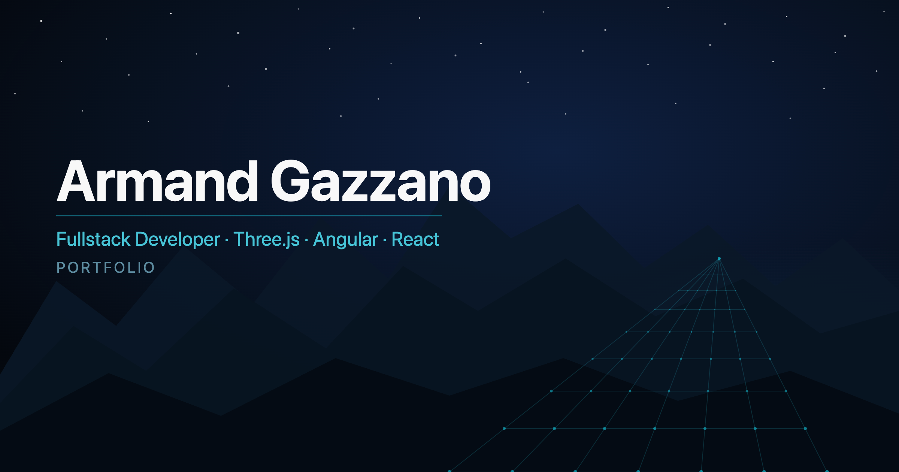

# armandgazzano.dev

Portfolio interactif construit autour de deux scènes 3D — une structure de kaplas avec simulation physique, et une scène navale avec les projets cliquables.

**→ [armandgazzano.dev](https://armandgazzano.dev)**



---

## Stack

| Domaine | Technos |
|---|---|
| Framework | React 19, Vite |
| 3D | Three.js, React Three Fiber, React Three Drei |
| Physique | React Three Rapier |
| i18n | i18next (FR / EN, détection auto) |
| Déploiement | Vercel |

## Fonctionnalités

- **Scène hero** — structure de kaplas procédurale avec physique temps réel (cliquer pour faire tomber)
- **Scène projets** — 6 modèles 3D navals cliquables, chacun lié à un projet professionnel
- **Modal projet** — description complète, stack technique, fermeture Escape / backdrop
- **Dark mode** — thème clair/sombre avec couleurs d'eau et d'éclairage différenciées
- **Bilingue** — FR/EN avec détection automatique de la langue navigateur
- **Loading screen** — suivi de progression des assets 3D
- **CV téléchargeable** — version FR et EN

## Lancer en local

```bash
npm install
npm run dev
```

## Structure

```
src/
├── components/
│   ├── models/           # Modèles 3D GLB (AircraftCarrier, Fregate, Rafale…)
│   ├── Scene.jsx         # Scène hero (kaplas + physique)
│   ├── ProjectsScene.jsx # Scène projets (océan + modèles navals)
│   └── ProjectModal.jsx  # Modal détail projet
├── data/
│   └── projects.js       # Stack technique par projet
├── i18n/
│   ├── fr.json
│   └── en.json
└── structures/           # Générateurs procéduraux (tour, arène, temple…)
```
