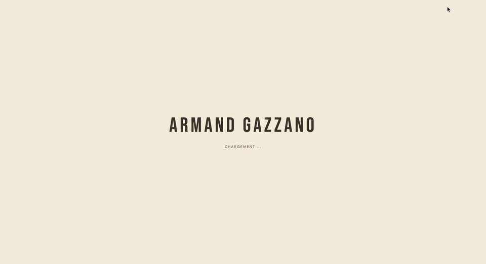

# armandgazzano.com

Interactive portfolio built around two 3D scenes — a procedural block structure with real-time physics simulation, and a naval scene where each model links to a professional project.

**→ [armandgazzano.com](https://armandgazzano.com)**



---

## Stack

|            |                                               |
| ---------- | --------------------------------------------- |
| Framework  | React 19, Vite                                |
| 3D         | Three.js, React Three Fiber, React Three Drei |
| Physics    | React Three Rapier                            |
| i18n       | i18next (FR / EN, auto-detected)              |
| Deployment | Vercel                                        |

## Features

- **Hero scene** — procedural block structure with real-time physics (click to knock it down)
- **Projects scene** — 6 clickable 3D naval models, each linked to a professional project
- **Project modal** — full description, tech stack, close with Escape or backdrop click
- **Dark mode** — light/dark theme with distinct water color and lighting
- **Bilingual** — FR/EN with automatic browser language detection
- **Loading screen** — asset progress tracking before scene reveal
- **Downloadable resume** — FR and EN versions

## Run locally

```bash
npm install
npm run dev
```

## Structure

```
src/
├── components/
│   ├── models/           # GLB 3D models (AircraftCarrier, Fregate, Rafale…)
│   ├── Scene.jsx         # Hero scene (blocks + physics)
│   ├── ProjectsScene.jsx # Projects scene (ocean + naval models)
│   └── ProjectModal.jsx  # Project detail modal
├── data/
│   └── projects.js       # Tech stack per project
├── i18n/
│   ├── fr.json
│   └── en.json
└── structures/           # Procedural generators (tower, arena, temple…)
```
